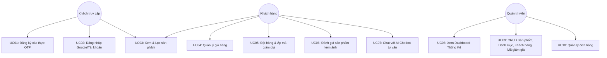

# BÁO CÁO ĐỒ ÁN

## PHÁT TRIỂN ỨNG DỤNG WEB

### Hệ thống Website Bán Hàng Công Nghệ Tích Hợp AI Chatbot (Sale Web Project)

---

# 1. GIỚI THIỆU ĐỀ TÀI

## 1.1 Mô tả bài toán

Trong thời đại số hóa, nhu cầu mua sắm các thiết bị công nghệ (điện thoại, laptop, tai nghe, đồng hồ thông minh...) trực tuyến của người tiêu dùng ngày càng gia tăng. Khách hàng không chỉ yêu cầu một website có giao diện trực quan, tốc độ tải nhanh, đầy đủ tính năng giỏ hàng và thanh toán tiện lợi, mà còn cần sự tư vấn nhanh chóng, chính xác về cấu hình và tình trạng kho hàng của từng sản phẩm. 

Đồng thời, đối với nhà quản lý (Admin), việc quản trị một hệ thống e-commerce đòi hỏi các công cụ theo dõi doanh thu trực quan, quản lý danh mục sản phẩm, đơn hàng từ khách hàng, quản lý mã giảm giá cũng như kiểm soát các đánh giá sản phẩm.

Hệ thống **Sale Web Project** được xây dựng nhằm giải quyết triệt để các vấn đề trên bằng cách cung cấp một website bán hàng công nghệ hoàn chỉnh cho khách hàng và admin, đồng thời tích hợp một hệ thống **AI Chatbot tự động** có khả năng truy vấn dữ liệu thời gian thực từ database để hỗ trợ tư vấn trực tuyến cho khách hàng.

---

## 1.2 Mục tiêu hệ thống

* **Frontend:** Xây dựng giao diện responsive đẹp mắt, mượt mà bằng HTML, CSS, JavaScript (Vanilla JS) không dùng framework nặng để tối ưu hóa hiệu năng tải trang.
* **Backend:** Phát triển hệ thống API RESTful hiệu năng cao sử dụng **FastAPI** (Python), hỗ trợ tự động sinh tài liệu kiểm thử qua Swagger UI.
* **Database:** Sử dụng hệ quản trị cơ sở dữ liệu quan hệ mạnh mẽ **PostgreSQL** kết hợp với **SQLAlchemy ORM** và công cụ quản lý migrations **Alembic**.
* **AI Chatbot:** Phát triển dịch vụ chatbot standalone tích hợp trực tiếp vào website dưới dạng widget nổi. Chatbot sử dụng **OpenRouter API** để kết nối các mô hình ngôn ngữ lớn (LLM) và truy vấn trực tiếp thông tin từ cơ sở dữ liệu (tên sản phẩm, giá bán, số lượng tồn kho) để trả lời chính xác câu hỏi của khách hàng.
* **Triển khai (Deployment):** Đóng gói toàn bộ hệ thống bằng **Docker** và **Docker Compose** (bao gồm 4 container: Database, Backend API, Frontend Nginx, và Chatbot Service) giúp triển khai hệ thống nhanh chóng chỉ bằng một dòng lệnh.

---

## 1.3 Phạm vi hệ thống

### Bao gồm

* **Chức năng Khách hàng (Customer):**
  * Đăng ký tài khoản (xác thực mã OTP gửi về Email).
  * Đăng nhập hệ thống (bằng tài khoản thường hoặc thông qua Google OAuth/Google Login).
  * Quản lý thông tin cá nhân, thay đổi mật khẩu và quản lý danh sách địa chỉ giao hàng.
  * Xem danh sách danh mục, tìm kiếm và lọc sản phẩm theo các tiêu chí (giá cả, đánh giá, danh mục).
  * Quản lý danh sách sản phẩm yêu thích (Wishlist) và giỏ hàng (Cart).
  * Đặt hàng (Checkout) hỗ trợ áp dụng mã giảm giá (Discount Code) và tính toán tổng tiền tự động.
  * Viết đánh giá sản phẩm (đánh giá sao kèm bình luận và hình ảnh thực tế).
  * Nhận thông báo hệ thống (Notification).

* **Chức năng Quản trị viên (Admin):**
  * Đăng nhập trang quản trị bảo mật.
  * Dashboard hiển thị biểu đồ doanh thu và thống kê sản phẩm bán chạy.
  * Quản lý danh mục (CRUD) và quản lý sản phẩm (CRUD kèm upload hình ảnh).
  * Quản lý đơn hàng (Xem chi tiết đơn hàng, cập nhật trạng thái đơn hàng: Chờ xử lý, Đang giao, Đã giao, Đã hủy).
  * Quản lý khách hàng, mã giảm giá, các đánh giá sản phẩm và xem nhật ký hệ thống (System Logs).

* **Chức năng AI Chatbot:**
  * Widget trò chuyện tự động hiển thị ở góc phải màn hình website.
  * Tự động nhận diện ngữ cảnh và tra cứu thông tin sản phẩm trực tiếp từ DB để tư vấn trực quan.

### Không bao gồm

* Ứng dụng di động (Mobile App) riêng biệt.
* Tích hợp cổng thanh toán trực tuyến thực tế (như Momo, VNPAY, thẻ Visa/Mastercard thực tế). Hệ thống hiện tại hỗ trợ phương thức giả lập thanh toán khi nhận hàng (COD) và thanh toán chuyển khoản ngân hàng giả lập.

---

# 2. PHÂN TÍCH YÊU CẦU HỆ THỐNG

## 2.1 Actors

* **Guest (Khách chưa đăng nhập):** Có thể duyệt sản phẩm, tìm kiếm, xem chi tiết sản phẩm, đăng ký tài khoản mới và đăng nhập.
* **Customer (Khách hàng đã đăng nhập):** Có đầy đủ quyền của Guest, đồng thời có thể quản lý giỏ hàng, đặt hàng, quản lý địa chỉ, đánh giá sản phẩm, quản lý wishlist, nhận thông báo và trò chuyện với AI Chatbot.
* **Admin (Quản trị viên):** Có toàn quyền truy cập trang quản trị để quản lý sản phẩm, đơn hàng, khách hàng, mã giảm giá và xem báo cáo doanh thu.
* **AI Chatbot:** Actor hệ thống tự động tương tác với khách hàng, truy xuất thông tin từ database để phản hồi câu hỏi.

---

## 2.2 Danh sách Use Case

| ID   | Use Case Name         | Actors               | Description                                                        |
| ---- | --------------------- | -------------------- | ------------------------------------------------------------------ |
| UC01 | Đăng ký & Xác thực    | Guest                | Đăng ký tài khoản qua Email và mã OTP gửi qua SMTP.                |
| UC02 | Đăng nhập             | Guest                | Đăng nhập bằng tài khoản thường hoặc Google OAuth.                |
| UC03 | Xem & Lọc Sản Phẩm    | Guest, Customer      | Duyệt danh sách sản phẩm, tìm kiếm và lọc theo danh mục.          |
| UC04 | Quản lý Giỏ Hàng      | Guest, Customer      | Thêm, cập nhật số lượng và xóa sản phẩm khỏi giỏ hàng.            |
| UC05 | Đặt Hàng & Áp Mã      | Customer             | Checkout giỏ hàng, nhập mã giảm giá và tạo đơn hàng mới.           |
| UC06 | Đánh Giá Sản Phẩm     | Customer             | Đánh giá số sao kèm viết bình luận và upload ảnh thực tế.          |
| UC07 | Trò chuyện với Chatbot| Customer             | Chat với AI tư vấn để hỏi về thông tin cấu hình, giá bán sản phẩm. |
| UC08 | Dashboard Thống Kê    | Admin                | Xem biểu đồ doanh thu và các chỉ số thống kê bán hàng.             |
| UC09 | Quản lý Cửa Hàng      | Admin                | CRUD Sản phẩm, Danh mục, Khách hàng, Mã giảm giá.                  |
| UC10 | Quản lý Đơn Hàng      | Admin                | Xem danh sách đơn hàng và cập nhật trạng thái giao hàng.           |

---

## 2.3 Use Case Diagram



---

## 2.4 Đặc tả Use Case

### UC05 — Đặt Hàng & Áp Dụng Mã Giảm Giá (Checkout & Discount Code)

* **Actors:** Customer
* **Description:** Khách hàng tiến hành thanh toán giỏ hàng, áp dụng mã giảm giá và tạo đơn hàng trên hệ thống.
* **Pre-condition:** Khách hàng đã đăng nhập và có ít nhất một sản phẩm trong giỏ hàng.
* **Post-condition:** Đơn hàng được tạo thành công trong database, số lượng tồn kho của sản phẩm giảm đi tương ứng, giỏ hàng local được làm trống.
* **Main Flow:**
  1. Người dùng truy cập trang Giỏ hàng và click chọn nút "Thanh toán".
  2. Hệ thống chuyển hướng người dùng đến trang Checkout.
  3. Hệ thống hiển thị thông tin địa chỉ mặc định, danh sách sản phẩm và tổng tiền tạm tính.
  4. Người dùng nhập mã giảm giá (ví dụ: `GIAM20`) và bấm nút "Áp dụng".
  5. Backend kiểm tra mã giảm giá (tồn tại, còn hạn, chưa vượt quá giới hạn lượt dùng).
  6. Hệ thống hiển thị số tiền được giảm và cập nhật lại tổng số tiền thanh toán thực tế.
  7. Người dùng chọn phương thức thanh toán (COD hoặc chuyển khoản) và click "Đặt hàng".
  8. Backend lưu đơn hàng vào database, trừ số lượng tồn kho sản phẩm, ghi nhận tăng lượt dùng của mã giảm giá.
  9. Hệ thống chuyển hướng người dùng sang trang thông báo đặt hàng thành công.

---

### UC07 — Trò chuyện với AI Chatbot (Chat with AI Chatbot)

* **Actors:** Customer, AI Chatbot
* **Description:** Người dùng gửi câu hỏi liên quan đến sản phẩm, chatbot AI tự động truy vấn dữ liệu từ database và trả lời.
* **Pre-condition:** Widget chatbot đã được tải thành công trên giao diện.
* **Post-condition:** Phản hồi thông tin chính xác cho khách hàng dựa trên dữ liệu thật.
* **Main Flow:**
  1. Người dùng click vào biểu tượng Chatbot nổi ở góc dưới bên phải màn hình.
  2. Người dùng nhập câu hỏi (Ví dụ: "Shop có tai nghe bluetooth nào giá dưới 1 triệu không?").
  3. Frontend gửi nội dung câu hỏi đến API Chatbot (`/api/chatbot`).
  4. Chatbot Service phân tích ngữ cảnh, gọi hàm lấy danh sách sản phẩm từ database với các bộ lọc tương ứng.
  5. Chatbot Service định dạng dữ liệu sản phẩm lấy được và gửi kèm câu hỏi gốc tới OpenRouter LLM API.
  6. Mô hình AI tổng hợp câu trả lời tự nhiên, thân thiện và gửi lại kết quả.
  7. Frontend hiển thị câu trả lời của Chatbot lên khung chat của người dùng.

---

# 3. THIẾT KẾ HỆ THỐNG

## 3.1 System Architecture

Hệ thống được thiết kế theo kiến trúc Microservices đóng gói bằng Docker bao gồm các lớp:

```
  Giao diện người dùng (Browser)
      │               │ (CORS Allowed)
      ▼               ▼
┌──────────────┐┌──────────────┐
│  Frontend    ││   Chatbot    │
│  Nginx Server││   Widget     │
│ (Port 5500)  ││ (Port 8001)  │
└──────────────┘└──────────────┘
      │               │
      │ REST API      │ DB Context & API
      ▼               ▼
┌──────────────────────────────┐
│       FastAPI Backend        │
│         (Port 8000)          │
└──────────────────────────────┘
      │
      ▼ SQLAlchemy ORM
┌──────────────────────────────┐
│      PostgreSQL Database     │
│         (Port 5432)          │
└──────────────────────────────┘
```

---

## 3.2 Database Design

Cơ sở dữ liệu PostgreSQL gồm các bảng chính:

### 1. categories
Bảng lưu trữ danh mục sản phẩm:
* `category_id` (VARCHAR, PK): Mã danh mục (Ví dụ: `CAT_PHONE`).
* `category_name` (VARCHAR, NOT NULL): Tên danh mục.
* `subcategory` (VARCHAR, NULL): Danh mục con.
* `description` (TEXT, NULL): Mô tả chi tiết.

### 2. products
Bảng lưu trữ thông tin sản phẩm:
* `product_id` (VARCHAR, PK): Mã sản phẩm (Ví dụ: `TN001`).
* `category_id` (VARCHAR, FK -> categories.category_id): Mã danh mục của sản phẩm.
* `product_name` (VARCHAR, NOT NULL): Tên sản phẩm.
* `description` (TEXT, NULL): Cấu hình, mô tả.
* `image_url` (VARCHAR, NULL): Link ảnh sản phẩm.
* `unit_price` (DECIMAL, NOT NULL): Đơn giá gốc.
* `discount_percent` (INTEGER, DEFAULT 0): Phần trăm giảm giá.
* `stock_quantity` (INTEGER, NOT NULL): Số lượng tồn kho.
* `rating_avg` (DECIMAL, DEFAULT 0.00): Điểm đánh giá trung bình.
* `total_reviews` (INTEGER, DEFAULT 0): Tổng số lượt đánh giá.

### 3. customers
Bảng lưu thông tin tài khoản khách hàng:
* `customer_id` (VARCHAR, PK): Mã khách hàng sinh ngẫu nhiên.
* `customer_name` (VARCHAR, NOT NULL): Tên hiển thị.
* `customer_email` (VARCHAR, UNIQUE, NOT NULL): Email dùng để đăng nhập.
* `phone_number` (VARCHAR, NULL): Số điện thoại.
* `password_hash` (VARCHAR, NULL): Mật khẩu đã được mã hóa bằng bcrypt (NULL nếu đăng nhập bằng Google).
* `google_id` (VARCHAR, NULL): ID liên kết tài khoản Google.
* `is_active` (BOOLEAN, DEFAULT TRUE): Trạng thái tài khoản.

### 4. addresses
Bảng lưu thông tin địa chỉ giao hàng của khách hàng:
* `address_id` (INTEGER, PK, Serial): Mã địa chỉ.
* `customer_id` (VARCHAR, FK -> customers.customer_id): Mã khách hàng sở hữu.
* `street` (VARCHAR, NOT NULL): Địa chỉ số nhà, tên đường.
* `district` (VARCHAR, NOT NULL): Quận/Huyện.
* `city` (VARCHAR, NOT NULL): Tỉnh/Thành phố.
* `zip_code` (VARCHAR, NULL): Mã bưu chính.
* `is_default` (BOOLEAN, DEFAULT FALSE): Đánh dấu địa chỉ mặc định.

### 5. orders
Bảng lưu trữ thông tin đơn đặt hàng tổng quát:
* `order_id` (VARCHAR, PK): Mã đơn hàng.
* `customer_id` (VARCHAR, FK -> customers.customer_id): Khách hàng đặt mua.
* `payment_method_id` (VARCHAR, FK -> payment_methods.payment_method_id): Phương thức thanh toán.
* `order_date` (TIMESTAMP, DEFAULT NOW()): Thời điểm đặt hàng.
* `status` (VARCHAR, DEFAULT 'Pending'): Trạng thái đơn hàng.
* `shipping_address` (TEXT, NOT NULL): Địa chỉ giao hàng.
* `shipping_fee` (DECIMAL, DEFAULT 0.00): Phí vận chuyển.
* `discount_amount` (DECIMAL, DEFAULT 0.00): Số tiền được giảm.
* `final_amount` (DECIMAL, NOT NULL): Tổng số tiền khách cần trả.

### 6. order_items
Bảng lưu chi tiết các sản phẩm trong từng đơn hàng:
* `order_item_id` (INTEGER, PK, Serial): Mã chi tiết.
* `order_id` (VARCHAR, FK -> orders.order_id, ON DELETE CASCADE): Mã đơn hàng cha.
* `product_id` (VARCHAR, FK -> products.product_id): Mã sản phẩm mua.
* `quantity` (INTEGER, NOT NULL): Số lượng mua.
* `unit_price` (DECIMAL, NOT NULL): Đơn giá tại thời điểm mua.

### 7. discount_codes
Bảng lưu trữ mã giảm giá cho hệ thống:
* `code` (VARCHAR, PK): Tên mã (Ví dụ: `KM50K`).
* `discount_percent` (INTEGER, DEFAULT 0): Phần trăm giảm giá.
* `max_discount_amount` (DECIMAL, DEFAULT 0.00): Số tiền giảm tối đa.
* `min_order_value` (DECIMAL, DEFAULT 0.00): Giá trị đơn hàng tối thiểu để áp dụng.
* `usage_limit` (INTEGER, DEFAULT 1): Giới hạn tổng số lượt dùng.
* `used_count` (INTEGER, DEFAULT 0): Số lượt đã sử dụng thực tế.
* `is_active` (BOOLEAN, DEFAULT TRUE): Trạng thái kích hoạt.
* `expiry_date` (TIMESTAMP, NULL): Hạn sử dụng mã.

### 8. reviews
Bảng lưu trữ các đánh giá sản phẩm của khách hàng:
* `review_id` (INTEGER, PK, Serial): Mã đánh giá.
* `product_id` (VARCHAR, FK -> products.product_id): Sản phẩm được đánh giá.
* `customer_id` (VARCHAR, FK -> customers.customer_id): Khách hàng viết đánh giá.
* `rating` (INTEGER, NOT NULL): Số sao đánh giá (1-5).
* `comment` (TEXT, NULL): Nội dung nhận xét.
* `image_urls` (VARCHAR, NULL): Link ảnh thực tế đi kèm (phân tách bằng dấu phẩy).
* `created_at` (TIMESTAMP, DEFAULT NOW()): Thời gian gửi đánh giá.

---

## 3.3 UI Design

Hệ thống cung cấp các trang giao diện trực quan và chuyên nghiệp:
* **Trang chủ Khách hàng (`/html/core/landing.html`):** Slide sản phẩm nổi bật, danh mục nổi bật, thống kê nhanh của cửa hàng và widget chatbot AI nổi ở góc dưới.
* **Trang sản phẩm (`/html/products/products.html`):** Bộ lọc danh mục, thanh tìm kiếm thông minh, sắp xếp sản phẩm theo giá/số sao, và hiển thị danh sách dạng lưới (Grid layout) responsive.
* **Trang chi tiết sản phẩm (`/html/products/product-detail.html`):** Hiển thị chi tiết hình ảnh, cấu hình kỹ thuật, số lượng tồn kho, form đánh giá sản phẩm mới và danh sách các đánh giá từ khách hàng khác.
* **Trang giỏ hàng (`/html/cart/cart.html`):** Danh sách sản phẩm chờ đặt, điều chỉnh số lượng trực tiếp và hiển thị tổng tiền tạm tính.
* **Trang thanh toán (`/html/cart/checkout.html`):** Form chọn địa chỉ nhận hàng, chọn phương thức thanh toán và ô nhập mã giảm giá khuyến mãi.
* **Trang tài khoản cá nhân (`/html/user/profile.html`):** Quản lý thông tin, đổi mật khẩu, xem lịch sử đơn hàng và danh sách sản phẩm yêu thích (wishlist).
* **Trang quản trị Admin (`/html/admin/admin.html`):** Sidebar điều hướng, các bảng quản lý trực tiếp sản phẩm, danh mục, đơn hàng, khách hàng, mã giảm giá và biểu đồ thống kê trực quan.

---

# 4. TRIỂN KHAI HỆ THỐNG

## 4.1 Môi trường phát triển

* **Frontend:** HTML5, CSS3, JavaScript (ES6+), Nginx làm Web Server tĩnh (Port 5500).
* **Backend API:** Python 3.11, FastAPI, Uvicorn Server (Port 8000).
* **AI Chatbot Service:** Python, FastAPI, OpenRouter Client (Port 8001).
* **Database Engine:** PostgreSQL 13 (Port 5432).
* **Cơ chế xác thực:** JWT (JSON Web Tokens) cho khách hàng thường, Google OAuth API cho đăng nhập qua Google.
* **Môi trường vận hành:** Docker & Docker Compose v2 trên nền Windows (WSL2).

---

## 4.2 Cấu trúc hệ thống

```
Sale_Web_Project/
 ├── backend/                   # FastAPI Backend
 │    ├── Admin/                # Module Quản trị Admin
 │    ├── alembic/              # Thư mục quản lý migration DB
 │    ├── app/
 │    │    ├── core/            # Logging, dependencies
 │    │    ├── models/          # Các Model SQLAlchemy
 │    │    ├── routers/         # Các API endpoint
 │    │    ├── schemas/         # Schema Pydantic để validate dữ liệu
 │    │    └── services/        # Xử lý logic nghiệp vụ
 │    └── requirements.txt      # Thư viện Python backend
 ├── CHAT BOT/                  # Module AI Chatbot standalone
 │    ├── backend/              # FastAPI Chatbot API
 │    └── frontend/             # Khung chat Widget JS/CSS nhúng
 ├── frontend/                  # Mã nguồn giao diện chính
 │    ├── css/                  # Các file style CSS của dự án
 │    ├── html/                 # Các trang HTML tĩnh
 │    └── js/                   # Xử lý gọi API và render động
 ├── docker/                    # Dockerfile và file config dịch vụ
 │    ├── frontend.Dockerfile
 │    └── nginx-frontend.conf   # Cấu hình Nginx phục vụ frontend
 ├── docker-compose.yml         # File khởi chạy toàn bộ 4 container
 └── README_DOCKER.md           # Hướng dẫn chạy dự án bằng tiếng Việt
```

---

## 4.3 Chức năng đã triển khai

* **Tính năng người dùng:** Đăng ký bằng mã OTP qua email, đăng nhập bảo mật qua JWT hoặc Google Login, cập nhật thông tin cá nhân, quản lý sổ địa chỉ, thêm vào danh sách yêu thích, đánh giá sản phẩm bằng cách tải ảnh lên, đặt đơn hàng nhanh chóng, theo dõi trạng thái đơn hàng thời gian thực.
* **Tính năng quản lý:** Dashboard trực quan, xem tổng doanh thu, số lượng đơn hàng, số khách hàng mới, CRUD đầy đủ sản phẩm và danh mục, thay đổi trạng thái giao nhận đơn hàng, thiết lập mã giảm giá và kích hoạt mã nhanh.
* **Trí tuệ nhân tạo:** Chatbot tự động nắm bắt thông tin cấu hình sản phẩm, lượng tồn kho thực tế, đưa ra gợi ý sản phẩm phù hợp ngân sách khi khách hàng hỏi trong ô chat.

---

## 4.4 API thiết kế

### 1. Nhóm API Khách Hàng (Customer & Auth)

| Method | Endpoint | Description |
| ------ | -------- | ----------- |
| POST | `/customers/` | Đăng ký tài khoản khách hàng mới. |
| POST | `/customers/register/request-otp` | Yêu cầu gửi mã OTP kích hoạt tài khoản về email. |
| POST | `/customers/register/with-otp` | Hoàn tất đăng ký bằng cách xác thực mã OTP. |
| POST | `/customers/login` | Đăng nhập và nhận Token JWT. |
| POST | `/customers/google` | Đăng nhập/Đăng ký nhanh bằng tài khoản Google. |
| GET | `/customers/me` | Lấy thông tin cá nhân của khách hàng hiện tại (cần Token). |

### 2. Nhóm API Sản Phẩm & Danh Mục (Products & Categories)

| Method | Endpoint | Description |
| ------ | -------- | ----------- |
| GET | `/categories/` | Lấy danh sách toàn bộ danh mục sản phẩm (giới hạn tối đa 100). |
| GET | `/products/` | Lấy danh sách sản phẩm kèm phân trang (giới hạn tối đa 100 sản phẩm/lượt). |
| GET | `/products/{product_id}` | Lấy chi tiết thông tin và thông số kỹ thuật của 1 sản phẩm. |
| GET | `/reviews/product/{product_id}` | Lấy danh sách bình luận, đánh giá của sản phẩm đó. |

### 3. Nhóm API Đơn Hàng & Khuyến Mãi (Orders & Discounts)

| Method | Endpoint | Description |
| ------ | -------- | ----------- |
| POST | `/orders/` | Tạo đơn hàng mới từ giỏ hàng hiện tại (cần Token). |
| GET | `/orders/` | Xem danh sách các đơn hàng đã đặt của khách hiện tại. |
| GET | `/discount-codes/{code}` | Kiểm tra tính hợp lệ và lấy thông tin chiết khấu của mã giảm giá. |

---

## 4.5 Giao diện đã triển khai

Giao diện hệ thống được thiết kế theo phong cách hiện đại (Modern Glassmorphism) với các hiệu ứng chuyển động mượt mà bằng CSS transitions:
* **Trang chủ:** banner trượt động (carousel) giới thiệu các sản phẩm bán chạy nhất, khung thống kê và widget chat nổi dễ dàng tương tác.
* **Bộ lọc sản phẩm:** thanh trượt lọc khoảng giá bán và bảng chọn nhanh danh mục sản phẩm.
* **Trang chi tiết sản phẩm:** thiết kế dạng cột đôi, hỗ trợ xem album ảnh, chấm điểm sao trung bình trực quan, hệ thống bình luận xếp chồng chuyên nghiệp.
* **Trang Admin:** thiết kế giao diện tối (Dark mode) sang trọng, hiển thị biểu đồ trực quan, danh sách quản lý dạng bảng (table) rõ ràng hỗ trợ phân trang và thanh tìm kiếm nhanh.

---

## 4.6 Luồng hoạt động hệ thống

### Ví dụ: Luồng đặt đơn hàng và áp dụng mã giảm giá

```
Khách hàng               Trình duyệt (JS)             Backend API (FastAPI)           PostgreSQL DB
    │                           │                              │                             │
    │ 1. Áp mã giảm giá         │                              │                             │
    ├──────────────────────────>│                              │                             │
    │                           │ 2. GET /discount-codes/{code}│                             │
    │                           ├─────────────────────────────>│                             │
    │                           │                              │ 3. SELECT * FROM discounts  │
    │                           │                              ├────────────────────────────>│
    │                           │                              │ <─ ─ ─ ─ ─ ─ ─ ─ ─ ─ ─ ─ ─ ─┤
    │                           │ 4. Trả về thông tin giảm giá │                             │
    │                           │<─ ─ ─ ─ ─ ─ ─ ─ ─ ─ ─ ─ ─ ─ ─┤                             │
    │ 5. Hiển thị tổng tiền mới │                              │                             │
    │<──────────────────────────┤                              │                             │
    │                           │                              │                             │
    │ 6. Click Đặt hàng         │                              │                             │
    ├──────────────────────────>│                              │                             │
    │                           │ 7. POST /orders/             │                             │
    │                           ├─────────────────────────────>│                             │
    │                           │                              │ 8. Kiểm tra tồn kho & Mã KM │
    │                           │                              ├────────────────────────────>│
    │                           │                              │ 9. INSERT INTO orders       │
    │                           │                              ├────────────────────────────>│
    │                           │                              │ 10. UPDATE stock_quantity   │
    │                           │                              ├────────────────────────────>│
    │                           │                              │ <─ ─ ─ ─ ─ ─ ─ ─ ─ ─ ─ ─ ─ ─┤
    │                           │ 11. Trả về Order ID          │                             │
    │                           │<─ ─ ─ ─ ─ ─ ─ ─ ─ ─ ─ ─ ─ ─ ─┤                             │
    │ 12. Báo thành công        │                              │                             │
    │<──────────────────────────┘                              │                             │
```

---

# 5. TEST CASE

Dưới đây là một số kịch bản kiểm thử (test cases) tiêu biểu trên hệ thống:

| ID   | Use Case / Chức năng  | Input Dữ liệu              | Kết quả Mong đợi (Expected Output)                  | Trạng thái |
| ---- | --------------------- | -------------------------- | --------------------------------------------------- | ---------- |
| TC01 | Đăng ký tài khoản     | Email chưa tồn tại + OTP đúng| Đăng ký thành công, lưu tài khoản vào DB.           | Pass       |
| TC02 | Đăng nhập tài khoản   | Nhập đúng Email và Mật khẩu| Hệ thống trả về JWT Token và chuyển sang trang chủ. | Pass       |
| TC03 | Đăng nhập thất bại    | Nhập mật khẩu sai          | Hệ thống báo lỗi "Invalid credentials" (401).       | Pass       |
| TC04 | Lọc sản phẩm          | Chọn danh mục "Tai nghe"   | Chỉ hiển thị các sản phẩm thuộc nhóm `CAT_HEADPHONE`.| Pass       |
| TC05 | Áp dụng mã giảm giá   | Nhập mã `GIAM20` hợp lệ    | Số tiền thanh toán thực tế giảm đi 20%.             | Pass       |
| TC06 | Vượt giới hạn API     | Lấy sản phẩm với `limit=500`| Backend trả về lỗi validation 422 (tối đa là 100). | Pass       |
| TC07 | Tư vấn sản phẩm (AI)  | Hỏi Chatbot về tai nghe rẻ | Chatbot gợi ý chính xác mã sản phẩm có giá thấp nhất.| Pass       |
| TC08 | Phân quyền Admin      | Tài khoản khách vào `/admin`| Trả về lỗi 403 Forbidden hoặc chặn chuyển trang.   | Pass       |

---

# 6. DEMO HỆ THỐNG

Sau khi khởi chạy hệ thống bằng Docker Desktop, hệ thống có thể truy cập qua các địa chỉ:
* **Giao diện Khách hàng (Frontend):** [http://localhost:5500](http://localhost:5500) hoặc [http://[::1]:5500](http://[::1]:5500) (Trình duyệt sẽ tự động chuyển hướng người dùng đến trang chủ [landing.html](file:///c:/Users/Admin/Documents/PROJECT_IT/Sale_Web_Project/frontend/html/core/landing.html)).
* **FastAPI Backend (Tài liệu OpenAPI):** [http://localhost:8000/docs](http://localhost:8000/docs)
* **Chatbot standalone (Health check):** [http://localhost:8001/health](http://localhost:8001/health)

### Thông tin tài khoản thử nghiệm:
* **Tài khoản Khách hàng:** `khachhang@tamtai.vn` / `123456` (hoặc tự đăng ký nhận mã OTP thật).
* **Tài khoản Admin mặc định:** `admin` (hoặc `admin@tamtai.vn`) / mật khẩu: `admin123cls`.

---

# 7. SỬ DỤNG AI TRONG ĐỒ ÁN

## 7.1 Tích hợp AI Chatbot tự động trong ứng dụng
Một điểm nhấn công nghệ của đồ án là dịch vụ **AI Chatbot**. Không giống các chatbot tĩnh thông thường, chatbot trong dự án hoạt động theo mô hình thông minh:
1. **Lấy dữ liệu ngữ cảnh (Context Injection):** Khi khách hàng đặt câu hỏi, chatbot API truy vấn danh sách sản phẩm, giá bán, số lượng tồn kho thực tế từ PostgreSQL.
2. **Gọi LLM API:** Chatbot gửi toàn bộ thông tin sản phẩm thu thập được làm ngữ cảnh (system prompt) cùng câu hỏi của khách hàng tới **OpenRouter API** để gọi các mô hình AI tiên tiến (như Gemini 1.5 Flash hoặc GPT-4o mini).
3. **Phản hồi thông minh:** AI trả lời khách hàng dưới dạng ngôn ngữ tự nhiên cực kỳ thân thiện và có độ chính xác tuyệt đối do có thông tin tồn kho và giá bán thật trong database.

---

## 7.2 Hỗ trợ lập trình bằng AI (AI-Assisted Coding)
Trong suốt quá trình xây dựng hệ thống, các công cụ AI (Copilot, Gemini, ChatGPT) đã được sử dụng hiệu quả:
* **Viết Boilerplate Code:** Tạo khung ứng dụng FastAPI, viết nhanh các file Schema Pydantic và Model SQLAlchemy tương ứng với thiết kế cơ sở dữ liệu.
* **Tối ưu hóa Truy vấn:** Hỗ trợ viết các câu lệnh truy vấn quan hệ lồng nhau (như lấy trung bình số sao đánh giá của sản phẩm và số lượng reviews tương ứng).
* **Thiết kế Giao diện:** Generate nhanh các đoạn mã CSS tạo hiệu ứng Glassmorphism hiện đại cho giao diện người dùng.

---

## 7.3 Đánh giá AI

### Ưu điểm (AI giúp đỡ):
* Tốc độ hoàn thành code nhanh hơn gấp 2-3 lần, đặc biệt là phần định nghĩa khung API.
* Khả năng tư vấn của Chatbot trên trang web rất tự nhiên và chính xác nhờ kỹ thuật kết hợp dữ liệu thật từ SQL với trí tuệ nhân tạo.

### Nhược điểm (Hạn chế & Lỗi của AI):
* **Sai sót về cấu hình mạng và CORS:** AI thường sinh thiếu địa chỉ IPv6 loopback (`[::1]`) trong cấu hình `allow_origins` của FastAPI, dẫn đến việc trang web truy cập qua `http://[::1]:5500` bị lỗi không tải được sản phẩm.
* **Lỗi tham số mặc định quá giới hạn:** AI viết lệnh lấy sản phẩm ở trang chủ với tham số `limit=500`, trong khi backend định nghĩa giới hạn tối đa `le=100`, gây ra lỗi hệ thống `422 Unprocessable Entity`.
* **Cách khắc phục:** Lập trình viên phải trực tiếp debug bằng các công cụ như `docker compose logs` để tìm ra lỗi CORS và lỗi tham số validation, từ đó chỉnh sửa mã nguồn cho đồng bộ.

---

# 8. PHÂN CÔNG NHÓM

| Thành viên | Nhiệm vụ chính trong Đồ án                                                          | Trạng thái |
| ---------- | ----------------------------------------------------------------------------------- | ---------- |
| Thành viên A| Thiết kế giao diện Frontend (HTML, CSS, JS), thiết kế trang Landing, Products, Cart.| Hoàn thành |
| Thành viên B| Phát triển Backend API (FastAPI), thiết kế Router, DB Models, Schema và Admin Portal. | Hoàn thành |
| Thành viên C| Thiết kế Database PostgreSQL, cấu hình migrations Alembic, setup Docker Compose.    | Hoàn thành |
| Thành viên D| Phát triển standalone AI Chatbot, tích hợp OpenRouter API, viết kịch bản kiểm thử.  | Hoàn thành |

---

# 9. KẾT LUẬN

Hệ thống **Website Bán Hàng Công Nghệ Tích Hợp AI Chatbot** đã được xây dựng và triển khai hoàn tất:
* Website hoạt động mượt mà, đồng bộ giữa các dịch vụ nhờ ảo hóa Docker Compose.
* Các tính năng nghiệp vụ cơ bản của một hệ thống bán hàng trực tuyến và trang quản trị bán hàng đã được triển khai hoàn chỉnh, bảo mật thông qua JWT và phân quyền Admin/Customer rõ ràng.
* Trí tuệ nhân tạo (AI Chatbot) được tích hợp sâu, truy xuất được dữ liệu thực tế giúp nâng cao trải nghiệm mua sắm của khách hàng.

### Hướng phát triển trong tương lai:
1. **Tích hợp cổng thanh toán trực tuyến:** Kết nối API thực tế của các cổng thanh toán Momo, ZaloPay hoặc VNPAY để khách hàng thanh toán trực tiếp qua QR code.
2. **Cải tiến Chatbot:** Nâng cấp chatbot hỗ trợ tính năng tự động tạo đơn hàng nháp (draft order) cho khách hàng ngay trong khung trò chuyện chat.
3. **Tối ưu SEO & CDN:** Tối ưu hóa SEO cho các trang sản phẩm và sử dụng CDN để lưu trữ hình ảnh sản phẩm giúp tăng tốc độ tải trang trên môi trường Internet toàn cầu.

---

# 10. TÀI LIỆU THAM KHẢO

[1] FastAPI Official Documentation — [https://fastapi.tiangolo.com](https://fastapi.tiangolo.com)  
[2] Nginx Documentation & Configuration Guide — [https://nginx.org](https://nginx.org)  
[3] Docker & Docker Compose V2 Guide — [https://docs.docker.com](https://docs.docker.com)  
[4] PostgreSQL 13 Database Manual — [https://www.postgresql.org/docs/13](https://www.postgresql.org/docs/13)  
[5] OpenRouter API Reference — [https://openrouter.ai/docs](https://openrouter.ai/docs)  
[6] SQLAlchemy ORM & Alembic migrations — [https://www.sqlalchemy.org](https://www.sqlalchemy.org)
